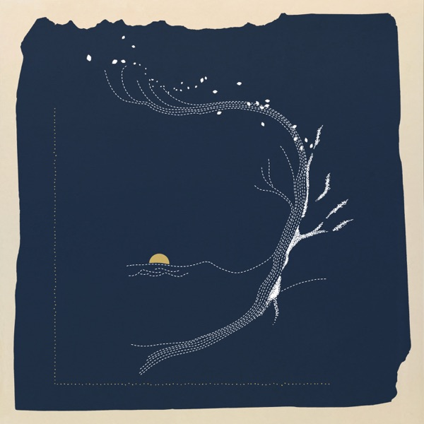

# Hi 👋 I'm Liam Wilbur!

## My Work
### [🌐 **Portfolio**](https://liam-wilbur.github.io)

## Contact me!

 

---

## Skills
### Languages: 

 
 
 
 
 
 

### Technologies:

  

---

<table>
  <tr>
    <th colspan="2">Top Tracks</th>
  </tr>

  <tr>
    <td style="width:70px; vertical-align:middle;">
      
    </td>
    <td style="vertical-align:middle;">
      <strong>Monday</strong> – Quadeca
    </td>
  </tr>

  <tr>
    <td style="width:70px; vertical-align:middle;">
      
    </td>
    <td style="vertical-align:middle;">
      <strong>Dancing with your Eyes Closed</strong> – Jane Remover
    </td>
  </tr>

  <tr>
    <td style="width:70px; vertical-align:middle;">
      
    </td>
    <td style="vertical-align:middle;">
      <strong>loop and it leave it</strong> – JPEGMAFIA
    </td>
  </tr>
</table>

---
_Thanks for stopping by ✨_
